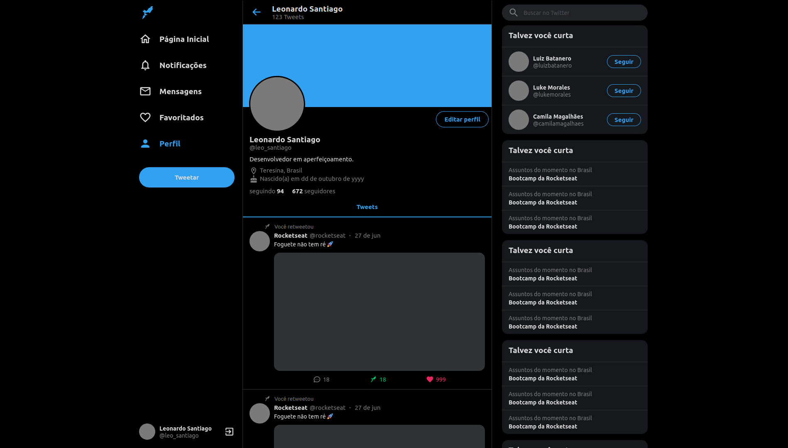

# UI Clone - Twitter (Responsive)

Projeto construído com base no quadro "UI Clone" da [Rocketseat]. Trata-se de uma cópia da interface do Twitter, para fins de estudo. Utilizando ReactJS, Styled Components e TypeScript, foi possível recriar a página, apresentando diferentes elementos no layout de acordo com a resolução do dispositivo utilizado.

## Preview



## Funcionamento

```
# Na pasta, baixe os pacotes necessários
npm install

# inicie a aplicação
npm start
```

# Tecnologias utilizadas

Esse projeto foi desenvolvido com as seguintes tecnologias:

- [React](https://reactjs.org)

[rocketseat]: https://rocketseat.com.br/
